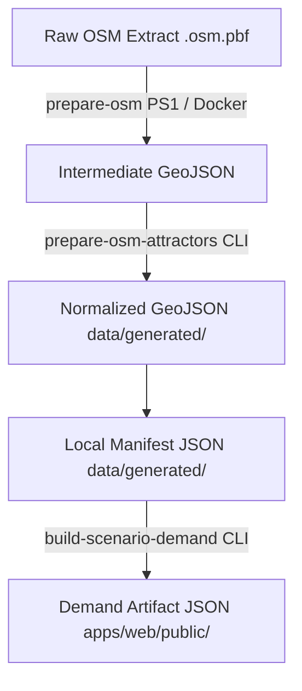

# OSM Attractor Source-Material Preparation

This guide describes how to extract and prepare local workplace/activity attractors derived from OpenStreetMap (OSM) spatial data for OpenVayra - Cities scenarios.

## Workflow Overview

Scenario attractors bridge the gap between artificial benchmark fixtures and full gameplay networks. Raw external sources pass through staged constraints before serving active clients:



### Data Pipelines
1. **Raw Source Material:** Local `.osm.pbf` extracts placed under `data/osm/<areaId>.osm.pbf` (e.g., `data/osm/hvv-mvp.osm.pbf`). These files are excluded from source control.
2. **Intermediate Geometry:** Unmapped raw objects extracted from PBF sources.
3. **Normalized Local Source:** Standard GeoJSON features restricted to playable boundaries with unified game semantics (`id, category, scale, weight`).
4. **Runtime Demand Payload:** Consolidated JSON read directly during active simulations.

## Execution Procedures

### 1. Geometry Extraction
Isolate spatial primitives via Docker-wrapped `osmium` utilities:
```bash
powershell -File scripts/scenario-demand/prepare-osm-attractors-source.ps1 -ScenarioId <scenarioId> -Area <areaId>
```
Or execute the Hamburg preset script:
```bash
pnpm scenario-demand:extract-osm-attractors:hamburg-core-mvp
```
*Outputs:* `data/generated/scenario-source-material/<scenarioId>/osm-attractors.raw.geojson`


### 2. Categorization & Normalization
Filter by bounds and compute operational sizes:
```bash
pnpm scenario-demand:prepare-osm-attractors:hamburg-core-mvp
```
*Requires census points to construct full configurations unless overridden via `--allow-fixture-residential`.*

*Outputs:*
- `data/generated/scenario-source-material/hamburg-core-mvp/workplace-attractors.normalized.geojson`
- `data/generated/scenario-source-material/hamburg-core-mvp/hamburg-core-mvp.local-demand.source-material.json`

> [!IMPORTANT]
> **Local Data Only:** Raw OSM extracts and generated local source material files are local to your environment and **must not be committed** to the repository. They are ignored by `.gitignore`.


### 3. Payload Assembly
Consolidate demographic endpoints:
```bash
pnpm scenario-demand:build:hamburg-core-mvp:local-demand
```

---

## Structural Postures

### Classified Tag Constraints

| Key | Filter Value | Category Mapping | Target Weight | Baseline Scale |
|---|---|---|---|---|
| `amenity` | `school`, `college` | `education` | `200` / `300` | `district` |
| `amenity` | `university` | `education` | `500` | `major` |
| `amenity` | `hospital`, `clinic` | `health` | `500` / `150` | `major` / `district` |
| `amenity` | `townhall` | `civic` | `100` | `district` |
| `office` | `*` | `workplace-office` | `100` | `district` |
| `shop` | `*` | `retail` | `50` | `local` |
| `tourism` | `attraction`, `museum` | `leisure-tourism` | `200` / `150` | `district` |
| `leisure` | `sports_centre`, `stadium`| `leisure-tourism` | `100` / `1000` | `district` / `major` |
| `landuse` | `commercial`, `retail` | Mixed Retail/Offices | Varies | `district` |
| `landuse` | `industrial` | `workplace-industrial`| `500` | `major` |

> [!WARNING]
> **Heuristic Constraints:** Extracted assignments represent synthetic simulation weights for destination routing logic rather than direct physical employment figures.

## Licensing & Scope
OSM spatial products use strictly bound Open Database License requirements. Do not bundle unapproved upstream binaries directly inside remote repositories.

> [!NOTE]
> **Simulation Scope:** This workflow is designed for gameplay demand simulation. It is **not** a tool for real-world transit reconstruction or planning.

